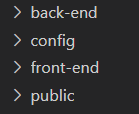

# Project Structure

Phyrus places all the framework stuff that you don't need to see in the **framework composer** directory (located in **/vendor/phyrus/framework**), so the project directory is cleaner, lighter and free of unnecessary files for you.

Phyrus is a full-stack framework composed of two halfs: **back-end** and **front-end**. **Back-End** works with **PHP** and with it you can develop an API, manage file uploads, queries to the database, models, business logic and all of that. Front-End uses **Nuxt**, which is a **Vue** framework: [https://nuxtjs.org](https://nuxtjs.org/).

As you can see, there are these two directories inside the project folder: **front-end**, and **back-end**.

Finally, the **/public** folder must be configured as the **root** of your web server, and will be the one who handles the browser request and decides to run a PHP file or display a Nuxt page.

You **don't need to do anything** in the /public directory, just leave it there, it will be used for publishing. Just use the **/front-end** directory for the website and the **/back-end** directory for the API.
